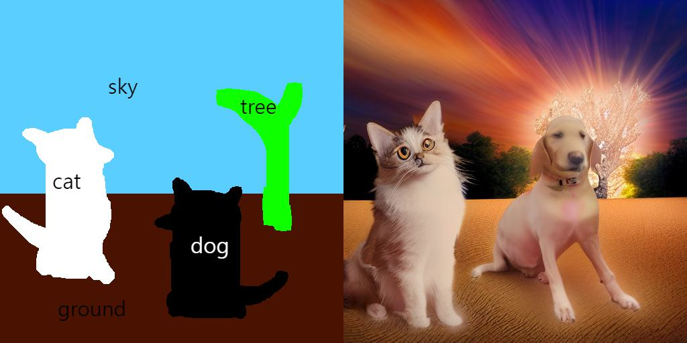
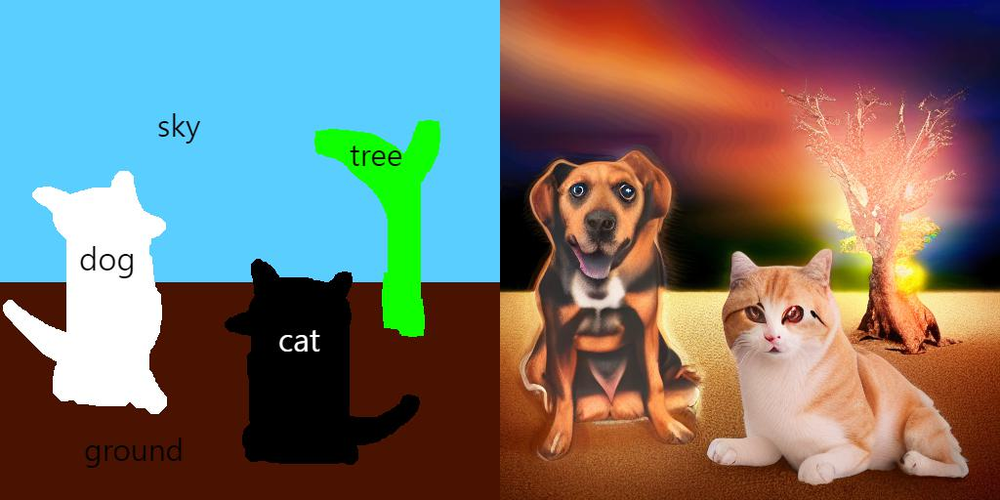

# Paint with Words, Implemented with Stable diffusion

<!-- #region -->
<p align="center">

</p>
<!-- #endregion -->

<!-- #region -->
<p align="center">

</p>
<!-- #endregion -->

> "realistic photo of a dog, cat, tree, with beautiful sky, on sandy ground"

<!-- #region -->
<p align="center">

</p>
<!-- #endregion -->

<!-- #region -->
<p align="center">

</p>
<!-- #endregion -->

> "A digital painting of a half-frozen lake near mountains under a full moon and aurora. A boat is in the middle of the lake. Highly detailed."

---

Very recently, researchers from NVIDIA proposed [eDiffi](https://arxiv.org/abs/2211.01324). In the paper, they suggested method that allows "painting with word". Basically, this is like make-a-scene, but with just using adjusted cross-attention score. You can see the results and detailed method in the paper.

Unfortunately, their paper and their method was not open-sourced. Yet, paint-with-words can be implemented with Stable Diffusion since they share common Cross Attention module. So, I implemented it with Stable Diffusion.

<!-- #region -->
<p align="center">

</p>
<!-- #endregion -->

# Installation

```bash
pip install git+https://github.com/cloneofsimo/paint-with-words-sd.git
```

# Basic Usage

Before running, fill in the variable `HF_TOKEN` in `.env` file with Huggingface token for Stable Diffusion, and load_dotenv().
