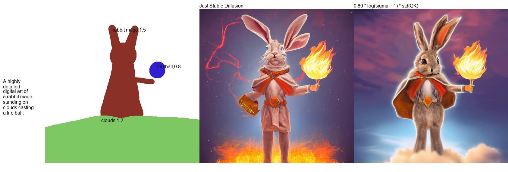
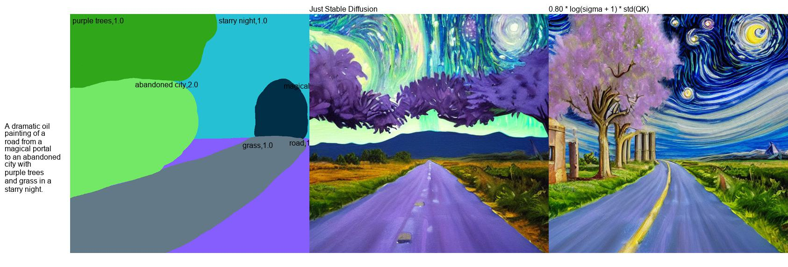
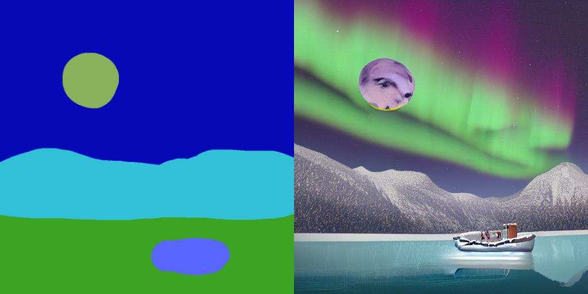
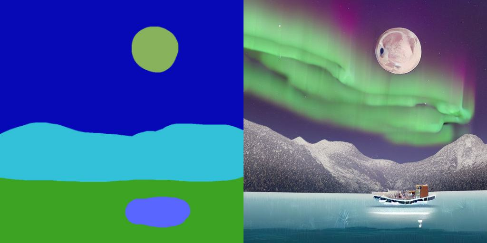
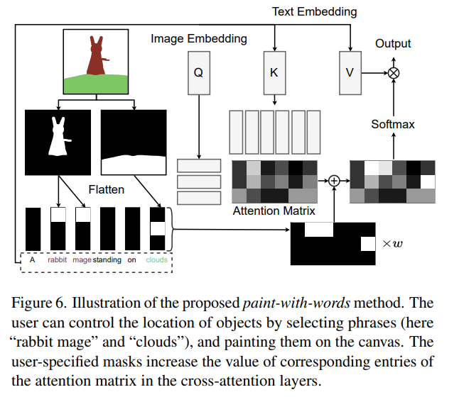
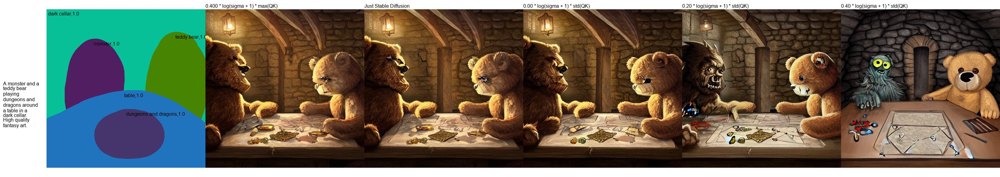
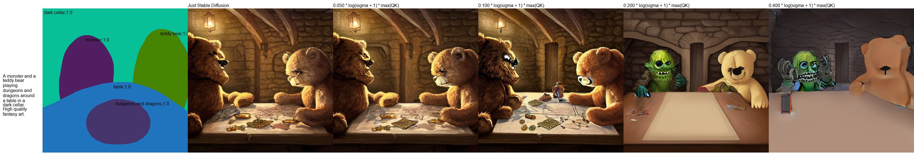
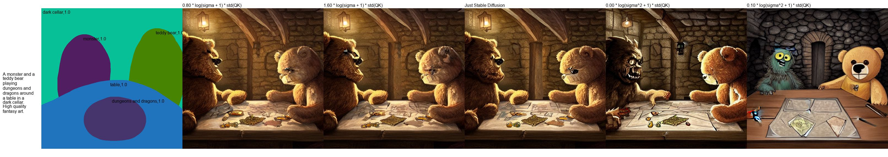
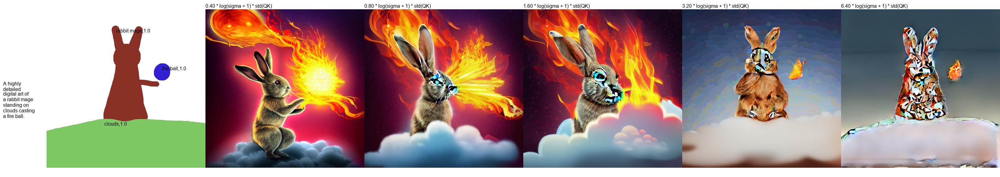
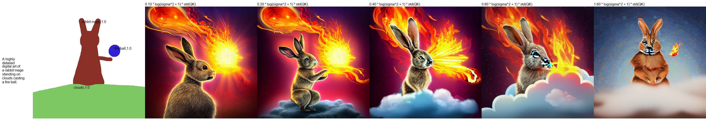

# Paint-with-Words, Implemented with Stable diffusion

## Subtle Control of the Image Generation

<!-- #region -->
<p align="center">

</p>
<!-- #endregion -->

> Notice how without PwW the cloud is missing.

<!-- #region -->
<p align="center">

</p>
<!-- #endregion -->

> Notice how without PwW, abandoned city is missing, and road becomes purple as well.

## Shift the object : Same seed, just the segmentation map's positional difference

<!-- #region -->
<p align="center">

</p>
<!-- #endregion -->

<!-- #region -->
<p align="center">

</p>
<!-- #endregion -->

> "A digital painting of a half-frozen lake near mountains under a full moon and aurora. A boat is in the middle of the lake. Highly detailed."

> Notice how nearly all of the composition remains the same, other than the position of the moon.

---

Recently, researchers from NVIDIA proposed [eDiffi](https://arxiv.org/abs/2211.01324). In the paper, they suggested method that allows "painting with word". Basically, this is like make-a-scene, but with just using adjusted cross-attention score. You can see the results and detailed method in the paper.

Their paper and their method was not open-sourced. Yet, paint-with-words can be implemented with Stable Diffusion since they share common Cross Attention module. So, I implemented it with Stable Diffusion.

<!-- #region -->
<p align="center">

</p>
<!-- #endregion -->

# Installation

```bash
pip install git+https://github.com/cloneofsimo/paint-with-words-sd.git
```

# Basic Usage

Before running, fill in the variable `HF_TOKEN` in `.env` file with Huggingface token for Stable Diffusion, and load_dotenv().

Prepare segmentation map, and map-color : tag label such as below. keys are (R, G, B) format, and values are tag label.

```python
{
    (0, 0, 0): "cat,1.0",
    (255, 255, 255): "dog,1.0",
    (13, 255, 0): "tree,1.5",
    (90, 206, 255): "sky,0.2",
    (74, 18, 1): "ground,0.2",
}
```

You neeed to have them so that they are in format "{label},{strength}", where strength is additional weight of the attention score you will give during generation, i.e., it will have more effect.

```python

import dotenv
from PIL import Image

from paint_with_words import paint_with_words

settings = {
    "color_context": {
        (0, 0, 0): "cat,1.0",
        (255, 255, 255): "dog,1.0",
        (13, 255, 0): "tree,1.5",
        (90, 206, 255): "sky,0.2",
        (74, 18, 1): "ground,0.2",
    },
    "color_map_img_path": "contents/example_input.png",
    "input_prompt": "realistic photo of a dog, cat, tree, with beautiful sky, on sandy ground",
    "output_img_path": "contents/output_cat_dog.png",
}


dotenv.load_dotenv()

color_map_image = Image.open(settings["color_map_img_path"]).convert("RGB")
color_context = settings["color_context"]
input_prompt = settings["input_prompt"]

img = paint_with_words(
    color_context=color_context,
    color_map_image=color_map_image,
    input_prompt=input_prompt,
    num_inference_steps=30,
    guidance_scale=7.5,
    device="cuda:0",
)

img.save(settings["output_img_path"])

```

There is minimal working example in `runner.py` that is self contained. Please have a look!

# Weight Scaling

In the paper, they used $w \log (1 + \sigma)  \max (Q^T K)$ to scale appropriate attention weight. However, this wasn't optimal after few tests, found by [CookiePPP](https://github.com/AUTOMATIC1111/stable-diffusion-webui/issues/4406). You can check out the effect of the functions below:

<!-- #region -->
<p align="center">

</p>
<!-- #endregion -->

> $w' = w \log (1 + \sigma)  std (Q^T K)$

<!-- #region -->
<p align="center">

</p>
<!-- #endregion -->

> $w' = w \log (1 + \sigma)  \max (Q^T K)$

<!-- #region -->
<p align="center">

</p>
<!-- #endregion -->

> $w' = w \log (1 + \sigma^2)  std (Q^T K)$

You can define your own weight function and further tweak the configurations by defining `weight_function` argument in `paint_with_words`.

Example:

```python
w_f = lambda w, sigma, qk: 0.4 * w * math.log(sigma**2 + 1) * qk.std()

img = paint_with_words(
    color_context=color_context,
    color_map_image=color_map_image,
    input_prompt=input_prompt,
    num_inference_steps=20,
    guidance_scale=7.5,
    device="cuda:0",
    preloaded_utils=loaded,
    weight_function=w_f
)
```

## More on the weight function, (but higher)

<!-- #region -->
<p align="center">

</p>
<!-- #endregion -->

> $w' = w \log (1 + \sigma)  std (Q^T K)$

<!-- #region -->
<p align="center">

</p>
<!-- #endregion -->

> $w' = w \log (1 + \sigma)  \max (Q^T K)$

<!-- #region -->
<p align="center">

</p>
<!-- #endregion -->

> $w' = w \log (1 + \sigma^2)  std (Q^T K)$
